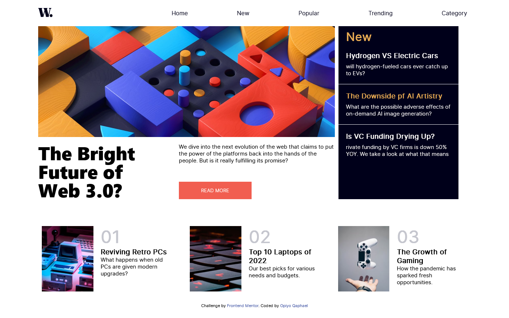
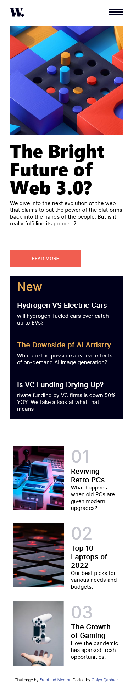

# Frontend Mentor - News homepage solution

This is a solution to the [News homepage challenge on Frontend Mentor](https://www.frontendmentor.io/challenges/news-homepage-H6SWTa1MFl). Frontend Mentor challenges help you improve your coding skills by building realistic projects. 

## Table of contents

-   [Overview](#overview)
  - [The challenge](#the-challenge)
  - [Screenshot](#screenshot)
  - [Links](#links)
  - [Built with](#built-with)
  - [What I learned](#what-i-learned)
  - [Useful resources](#useful-resources)
  - [Author](#author)


## Overview
This is the front end mentor challenge recreation of  News homepage solution I did following my other frontend mentor code challenges

### The challenge

Users should be able to:

- View the optimal layout for the interface depending on their device's screen size
- See hover and focus states for all interactive elements on the page

### Screenshot




### Links

- Solution URL: [Add solution URL here](https://your-solution-url.com)
- Live Site URL: [Add live site URL here](https://your-live-site-url.com)

## My process

### Built with

- Semantic HTML5 markup
- CSS custom properties
- Flexbox
- CSS Grid
- vscode

### What I learned

I learned and practiced a great deal of flex property in this challenge for positioning
I also learned alot of grid positioning since it was tyhe most challenging thing to do.

### Code I'm Proud of

```html
<h1>Some HTML code I'm proud of</h1>
<!-- ############### ITEM 3 ############### -->
<div class="grid-item item3">
  <div class="grid--item--3 grid--item">
    <div class="head--3--box">
      <h1 class="head--3--text">The Bright Future of Web 3.0?</h1>
    </div>
  </div>
</div>

```
```css
.proud-of-this-css {
  color: papayawhip;
}

  .grid-container {
    grid-template-columns: auto;
  }

  .item1 {
    grid-column: 1 / span 3;
    grid-row: 1;
  }

  .item2 {
    grid-column: 1 / span 3;
    grid-row: 4;
  }

  .item3 {
    grid-column: 1 / span 3;
    grid-row: 2;
  }

  .item4 {
    grid-column: 1 / span 3;
    grid-row: 3;
    padding: 0 0 2rem;
  }

```
```js
const proudOfThisFunc = () => {
  console.log('🎉')
}

const linkAction = () => {
  menu.classList.remove("open-menu");
  overlay.style.display = "none";
};
navLink.forEach((n) => n.addEventListener("click", linkAction));

```

### Useful resources

- [google fonts](https://fonts.google.com/) - This helped me for fonts i used in this challenge.

## Author

- Website - [Qaphael Opiyo](https://qaphael-portfolio-website.web.app/)
- Frontend Mentor - [@Qaphael](https://www.frontendmentor.io/profile/Qaphael)
- Twitter - [@laflo__lr](https://twitter.com/Laflo_lr)
- Github - [@Qaphael](https://github.com/Qaphael)

